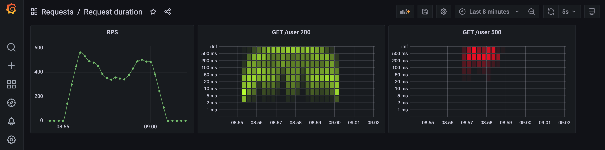
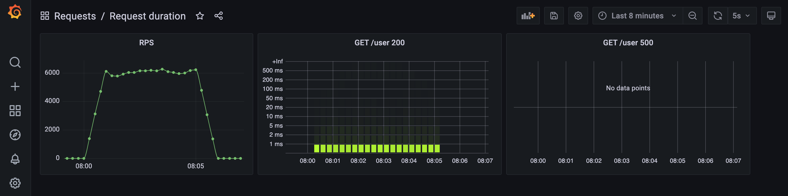

# Go API Demo

This repo contains code for an API written in Go.

## Overview

To run the API you'll need to have Go installed.

### gRPC
Install a _Protocol Buffer Compiler_, and the
_Go Plugins_ for the compiler (see the
[gRPC Quickstart](https://grpc.io/docs/languages/go/quickstart/) for details) if you 
want to:
* compile the _.proto_ files by running `make proto` and/or
* manually issue gRPC requests using [gRPCurl](https://github.com/fullstorydev/grpcurl).

### Make

The _Makefile_ contains commands for building, running and testing the API.

* `make run` builds and runs the binary.
* `make build` just builds the binary.
* `make fmt` formats the code, updates import lines and runs clean.
* `make lint` runs golangci-lint.
* `make proto` generates protobuf files from proto files.
* `make test` runs the linter then the tests (see [Tests](#tests)).

### <a name="tests"></a>Tests

Install [testify](https://github.com/stretchr/testify#installation) then run `make test`.

### Manual Testing

You can test the API manually using a client. For instance 
[Insomnia](https://insomnia.rest/download)
supports both HTTP and [gRPC](https://support.insomnia.rest/article/188-grpc#overview). 

Alternatively, requests can be issued using cURL and
[gRPCurl](https://github.com/fullstorydev/grpcurl).

## v0.5.0

Adds metrics and dashboard visualisation for HTTP request duration, using
[Prometheus](https://prometheus.io/) and [Grafana](https://grafana.com/), respectively.

### Set-up

    make docker-up

_Prometheus_ is accessible at [http://localhost:9090](http://localhost:9090)

_Grafana_ is accessible at [http://localhost:3456](http://localhost:3456)
* The dashboard for requests can be found by using _Search_ and drilling into the
  _Requests_ folder.


### Metrics

Using the cURL requests for _user_ endpoints (see [v0.2.0](#v0.2.0) and [v0.3.0](#v0.3.0))
will generate metrics.

Raw metrics can be seen by running `curl localhost:3000/metrics`.

Metrics are also visible in [Prometheus](http://localhost:9090) and HTTP request duration
can be seen by searching for:
* request_duration_seconds_bucket
* request_duration_seconds_count
* request_duration_seconds_sum

### Load Testing

Running (see [docker](#k6_docker) or [local](#k6_local)) the [k6](https://k6.io/) script
will generate meaningful output for the [Grafana](http://localhost:3456) dashboard.

#### <a name="k6_docker"></a>Docker

     docker run -e HOST=host.docker.internal -i loadimpact/k6 run - <k6/get.js

#### <a name="k6_local"></a>Local

[Install k6](https://k6.io/docs/getting-started/installation/) and run:

    k6 run -e HOST=localhost k6/get.js

### Dashboard

Following is the output from running the _k6_ script which ramps up from 1-200 virtual
users (vus) over 2 minutes, maintains 200 vus for 1 minute, then ramps down to 0 vus
over 2 minutes.

The two load tests were run using either MySQL or in-memory data storage (see 
[v0.3.0](#v0.3.0) for configuration).  

#### MySQL



08:55 - 09:00 marks the duration of the load test.

Initially the number of requests per second (rps) increases as the number of vus rises,  
and, an accompanying increase in the request duration can be seen in the heat map for 
successful (200) requests. 

The rps then decreases and more of the successful requests take longer, plateauing during
the sustained load of 200 vus and is accompanied by the emergence of failed (500) 
requests. 

##### Logs

```
{"commitHash":"e04cc2d0917ead700130dd378376a75a21c99930","level":"warning","msg":"context deadline exceeded","time":"2021-07-30T08:58:03+01:00"}
{"commitHash":"e04cc2d0917ead700130dd378376a75a21c99930","level":"warning","msg":"Error 1040: Too many connections","time":"2021-07-30T08:58:04+01:00"}
```

As the number of vus is ramped down, rps increases, successful request duration decreases
and failed requests disappear.

##### k6 Output

```
  execution: local
     script: k6/get.js
     output: -

  scenarios: (100.00%) 1 scenario, 200 max VUs, 5m30s max duration (incl. graceful stop):
           * default: Up to 200 looping VUs for 5m0s over 3 stages (gracefulRampDown: 30s, gracefulStop: 30s)


running (5m00.0s), 000/200 VUs, 141654 complete and 0 interrupted iterations
default ✓ [======================================] 000/200 VUs  5m0s

     ✗ status was 200
      ↳  96% — ✓ 136806 / ✗ 4848

     checks.........................: 96.57% ✓ 136806     ✗ 4848
     data_received..................: 50 MB  167 kB/s
     data_sent......................: 12 MB  40 kB/s
     http_req_blocked...............: avg=27.32µs  min=1µs    med=4µs     max=325.8ms  p(90)=6µs      p(95)=7µs
     http_req_connecting............: avg=22.56µs  min=0s     med=0s      max=325.72ms p(90)=0s       p(95)=0s
     http_req_duration..............: avg=254.72ms min=1.81ms med=76.84ms max=3.02s    p(90)=794.9ms  p(95)=1.1s
       { expected_response:true }...: avg=246.55ms min=1.81ms med=71.32ms max=2.78s    p(90)=795.03ms p(95)=1.11s
     http_req_failed................: 3.42%  ✓ 4848       ✗ 136806
     http_req_receiving.............: avg=66.19µs  min=17µs   med=57µs    max=29.42ms  p(90)=96µs     p(95)=122µs
     http_req_sending...............: avg=23.78µs  min=6µs    med=20µs    max=31.37ms  p(90)=33µs     p(95)=41µs
     http_req_tls_handshaking.......: avg=0s       min=0s     med=0s      max=0s       p(90)=0s       p(95)=0s
     http_req_waiting...............: avg=254.63ms min=1.75ms med=76.75ms max=3.02s    p(90)=794.82ms p(95)=1.1s
     http_reqs......................: 141654 472.187596/s
     iteration_duration.............: avg=254.92ms min=1.91ms med=77.05ms max=3.02s    p(90)=795.13ms p(95)=1.1s
     iterations.....................: 141654 472.187596/s
     vus............................: 1      min=1        max=200
     vus_max........................: 200    min=200      max=200
```

#### In-Memory



08:00 - 08:05 marks the duration of the load test.

Initially the number of requests per second (rps) increases as the number of vus rises, 
and, successful (200) request duration remains stable.

The rps levels off with successful request duration remaining stable. 

As the number of vus is ramped down, rps remains stable. There are no failed (500) 
requests during this load test.

##### k6 Output

```
  execution: local
     script: k6/get.js
     output: -

  scenarios: (100.00%) 1 scenario, 200 max VUs, 5m30s max duration (incl. graceful stop):
           * default: Up to 200 looping VUs for 5m0s over 3 stages (gracefulRampDown: 30s, gracefulStop: 30s)


running (5m00.0s), 000/200 VUs, 1816350 complete and 0 interrupted iterations
default ✓ [======================================] 000/200 VUs  5m0s

     ✓ status was 200

     checks.........................: 100.00% ✓ 1816350     ✗ 0
     data_received..................: 200 MB  666 kB/s
     data_sent......................: 153 MB  509 kB/s
     http_req_blocked...............: avg=3.66µs  min=1µs      med=3µs    max=20.91ms p(90)=4µs     p(95)=5µs
     http_req_connecting............: avg=41ns    min=0s       med=0s     max=7.8ms   p(90)=0s      p(95)=0s
     http_req_duration..............: avg=19.72ms min=235µs    med=2.73ms max=2.34s   p(90)=13.12ms p(95)=32.86ms
       { expected_response:true }...: avg=19.72ms min=235µs    med=2.73ms max=2.34s   p(90)=13.12ms p(95)=32.86ms
     http_req_failed................: 0.00%   ✓ 0           ✗ 1816350
     http_req_receiving.............: avg=43.5µs  min=12µs     med=35µs   max=17.14ms p(90)=58µs    p(95)=76µs
     http_req_sending...............: avg=17.17µs min=5µs      med=13µs   max=19.74ms p(90)=22µs    p(95)=29µs
     http_req_tls_handshaking.......: avg=0s      min=0s       med=0s     max=0s      p(90)=0s      p(95)=0s
     http_req_waiting...............: avg=19.65ms min=208µs    med=2.67ms max=2.34s   p(90)=13.05ms p(95)=32.78ms
     http_reqs......................: 1816350 6054.831623/s
     iteration_duration.............: avg=19.85ms min=289.96µs med=2.86ms max=2.34s   p(90)=13.26ms p(95)=33.11ms
     iterations.....................: 1816350 6054.831623/s
     vus............................: 1       min=1         max=200
     vus_max........................: 200     min=200       max=200
```

## v0.4.0

Adding HTTP and gRPC endpoints for retrieving users.

### HTTP
#### Request

    curl -i --request GET \
    --url http://localhost:3000/user

##### Response

    HTTP/1.1 200 OK
    Content-Type: application/json
    Date: Mon, 26 Jul 2021 19:29:12 GMT
    Content-Length: 251

    [
      {
        "id":"39965d61-01f2-4d6d-8215-4bb88ef2a837",
        "first_name":"john",
        "last_name":"smith",
        "created_at":"2021-07-26T19:23:52Z"
      },
      {
        "id":"c0e137e3-6689-41c3-a421-0bf44f44d746",
        "first_name":"joanna",
        "last_name":"smithson",
        "created_at":"2021-07-26T19:23:52Z"
      }
    ]

### gRPC

You'll need to generate a protoset and have
[gRPCurl](https://github.com/fullstorydev/grpcurl) installed.

#### Generate protoset

    protoc \
    -I=proto \
    --descriptor_set_out=generated/user.protoset \
    user.proto

#### Request

    grpcurl \
    -plaintext \
    -protoset generated/user.protoset \
    localhost:1234 User/Read

#### Response

    {
      "users": [
        {
          "id": "39965d61-01f2-4d6d-8215-4bb88ef2a837",
          "firstName": "john",
          "lastName": "smith",
          "createdAt": "2021-07-26T19:23:52Z"
        },
        {
          "id": "c0e137e3-6689-41c3-a421-0bf44f44d746",
          "firstName": "joanna",
          "lastName": "smithson",
          "createdAt": "2021-07-26T19:23:52Z"
        }
      ]
    }

## <a name="v0.3.0"></a>v0.3.0

Stores created users either in-memory or in MySQL.

To use MySQL storage you'll need to install 
[golang-migrate](https://github.com/golang-migrate/migrate/tree/master/cmd/migrate) and
run the following commands:

    make docker-up
    make migrate-up

Running `make docker-up` will
* copy `.env.dist` => `.env`
  * `USER_STORAGE` (either _memory_ or _sql_) determines whether users are stored 
    in-memory or in MySQL.
* start a docker-based instance of MySQL.

Running `make migrate-up` creates the table in MySQL for storing users.

The same cURL and gRPCurl requests as described for [v0.2.0](#v0.2.0) can be used.

## <a name="v0.2.0"></a>v0.2.0

Adding HTTP and gRPC endpoints for user creation.

Users are stored in-memory.

### HTTP
#### Request

    curl -i --request POST \
    --url http://localhost:3000/user \
    --header 'Content-Type: application/json' \
    --data '{
        "first_name": "john",
        "last_name": "smith"
    }'

##### Response

    HTTP/1.1 201 Created
    Content-Type: application/json
    Date: Tue, 06 Jul 2021 12:03:25 GMT
    Content-Length: 127

    {
        "id":"afaa2920-77e4-49d0-a29f-5f2d9b6bf2d1",
        "first_name":"john",
        "last_name":"smith",
        "created_at":"2021-07-06T13:03:25+01:00"
    }

### gRPC

You'll need to generate a protoset and have 
[gRPCurl](https://github.com/fullstorydev/grpcurl) installed.

#### Generate protoset

    protoc \
    -I=proto \
    --descriptor_set_out=generated/user.protoset \
    user.proto

#### Request

    grpcurl \
    -plaintext \
    -protoset generated/user.protoset \
    -d '{"first_name": "john", "last_name": "smith"}' \
    localhost:1234 User/Create

#### Response

    {
        "id": "ca3d9549-eb8d-4b5a-b45f-3551fb4fbdc9",
        "firstName": "john",
        "lastName": "smith",
        "createdAt": "2021-07-06T13:08:45+01:00"
    }

## v0.1.0

Basic HTTP and gRPC server.

### HTTP
#### Request

    curl -i localhost:3000

##### Response

    HTTP/1.1 200 OK
    Date: Tue, 22 Jun 2021 11:19:48 GMT
    Content-Length: 0

### gRPC

You'll need to generate a protoset and have
[gRPCurl](https://github.com/fullstorydev/grpcurl) installed.

#### Generate protoset

    protoc \
    -I=proto \
    --descriptor_set_out=generated/hello.protoset \
    hello.proto

#### Request

    grpcurl \
    -plaintext \
    -protoset generated/hello.protoset \
    -d '{"name": "world"}' \
    localhost:1234 Hello/Hello

#### Response

    {
      "message": "Hello world"
    }
